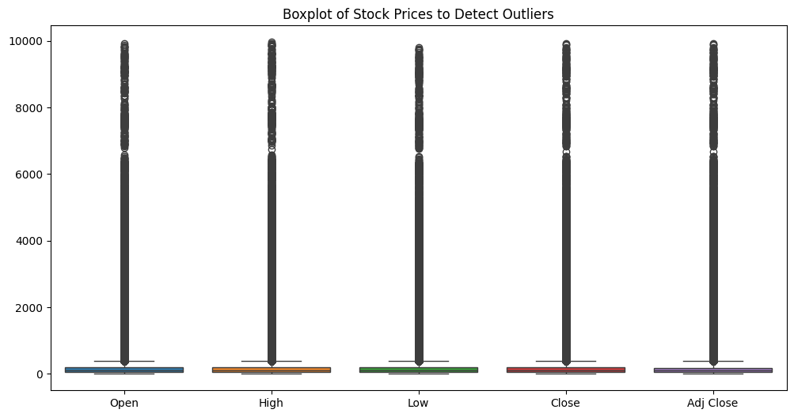
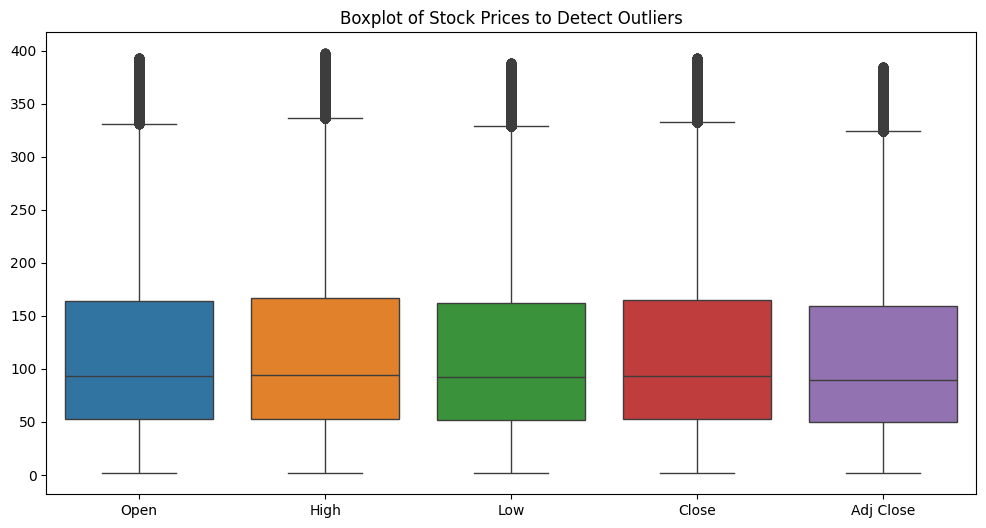
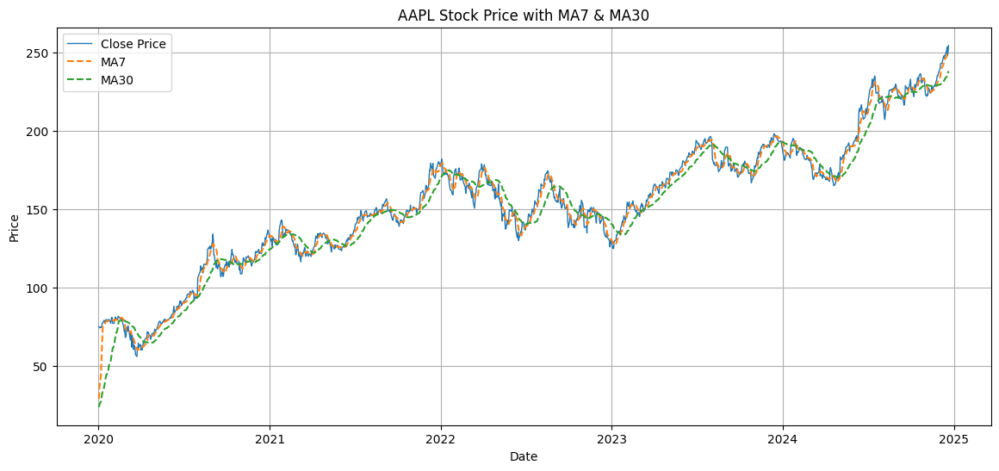
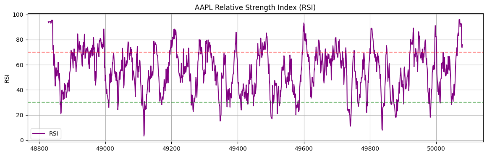
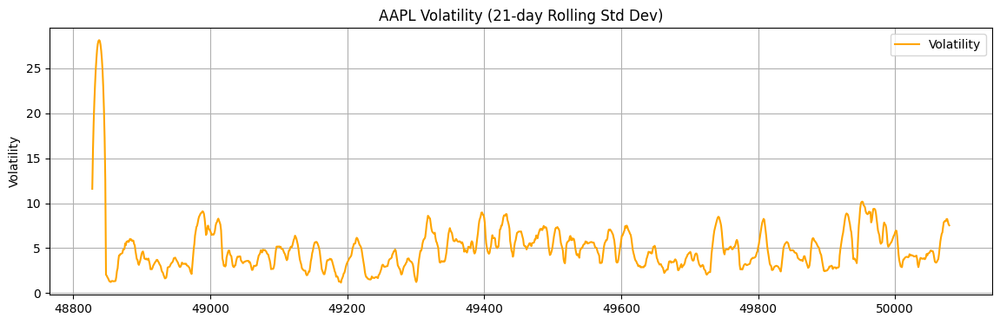

# 📊 S&P 500 Stock Analysis Dashboard  
**Track price trends, volatility, and momentum of S&P 500 companies with Python + Tableau**

---

## 📁 Dataset  
Source: [Kaggle – S&P 500 Stock Data](https://www.kaggle.com/datasets/keehyung/mit5742-sp500-stock-value-dataset)  
- Contains stock data from 2020 to 2024 for 500+ companies including Open, High, Low, Close, Adj Close, and Volume.

> 📌 Note: The dataset is not included in this repo due to size constraints. You can download it directly from Kaggle and place it in the working directory as `sp500.csv` to run the notebook.

---

## 🧪 Project Overview  

This project analyzes historical stock data for S&P 500 companies and presents a dynamic Tableau dashboard that supports cross-company insights. The analysis includes outlier detection, trend indicators, volatility tracking, and performance comparisons.

---

## ⚙️ Key Features & Visual Insights

### 1. 🧼 Outlier Detection  
Cleaned the dataset using **IQR filtering** to remove extreme price values before generating indicators.  

>   
>   
> *Boxplots showing stock price distributions before and after outlier removal.*

---

### 2. 📈 Moving Averages (MA7, MA30)  
Calculated **7-day** and **30-day** moving averages to smooth price trends and highlight momentum.

>   
> *Closing price overlaid with MA7 and MA30 for a selected company.*

---

### 3. 💪 Relative Strength Index (RSI)  
Computed **RSI** to capture overbought and oversold conditions across stocks.

>   
> *RSI values with horizontal reference lines at 30 and 70.*

---

### 4. 🌪️ 21-Day Rolling Volatility  
Tracked short-term risk by calculating **rolling standard deviation** of closing prices.

>   
> *Rolling volatility over time, used to assess stock stability.*

---

## 📊 Tableau Dashboard  

An interactive Tableau dashboard allows users to:
- Select companies via dropdown filter
- Compare Close price trends, RSI, Volatility, and % Change
- Instantly view:
  - 🟢 Top Gainer  
  - 🔴 Most Volatile  
  - 📈 Highest RSI  

🔗 **[View Dashboard on Tableau Public](https://public.tableau.com/app/profile/aditya.ailsnghani/viz/SP500Dashboard_17481212663870/Dashboard1)**

---

## 🧰 Technologies Used  
- **Python**: pandas, numpy, matplotlib, seaborn  
- **Jupyter Notebook**: for preprocessing, outlier handling, and indicator calculations  
- **Tableau Public**: for dynamic multi-metric visualization  
- **Data Source**: Kaggle

---

## 🚀 How to Reproduce  
1. Clone this repository  
2. Download the dataset from Kaggle and place it in the root folder as `sp500.csv`  
3. Run `StockPrice.ipynb` to generate moving averages, RSI, and volatility indicators  
4. (Optional) Export the processed CSV and load it into Tableau to build your own dashboard  
5. Alternatively, explore the live dashboard using the link above

---

## 📎 License  
This project is licensed under the [MIT License](License).

---

## 📬 Contact  
Created by *Aditya Ailsinghani* — feel free to connect on [LinkedIn](https://www.linkedin.com/in/aditya-ailsinghani/)
